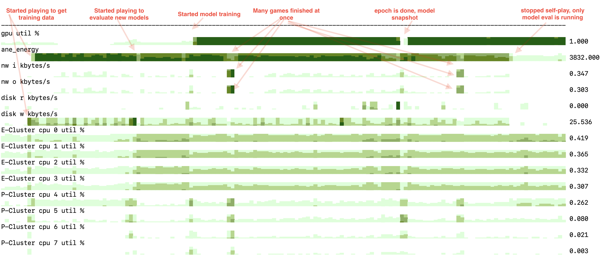

This is an in-progress attempt (with very slow progress) to find a solution to some game. 

Most likely candidates are Othello 8x8 or freestyle gomoku on 8x8 - 9x9 boards.  

Rough idea is the following:
1. Use self-play Deep RL (think AlphaZero) to get a very strong model for the game <---- we are here now
2. Use that model to provide a good ordering for full search, like [PVS](https://www.chessprogramming.org/Principal_Variation_Search)

Currently is tested on:
1. Apple's M* SoC (using GPU for training, ANE for self-play)
2. x86 Linux with nVidia GPUs

### script to setup everything for lambda cloud instance

just pull everything we need.

```
wget -O ~/lambda_rlscout_setup.sh https://raw.githubusercontent.com/okuvshynov/rlscout/master/scripts/lambda_setup.sh && chmod +x ~/lambda_rlscout_setup.sh && ~/lambda_rlscout_setup.sh
```


## TODO now

Immediate next steps:
```
[ ] get rid of all hardcoded constants in the code.
[x] Implement batching for self-play. We already run multiple search procedures in parallel, but call prediction on batch of size 1. This is very inefficient for any underlying HW (CPU, Apple's Neural Engine, GPU). Aggregate across the self-play and evaluate once instead. This will get more important for larger models.
    [x] basic self-play is done
    [x] handle model updates
    [x] write the data
[x] get rid of locks on every rollouts, that scales poorly with # of threads growing
    [x] looks like the better way would be to call back to Python with the full batch.
    [x] actually, let's just move more of self-play to native. Only do callbacks for moves logging and batch prediction? 
[x] batched MCTS next steps:
    [x] do log
    [x] write util to visualize sample
    [x] support no model case
    [x] support model update
    [x] support different players case / make duel batched as well
    [x] add exploration (select node by sampling, not greedily picking max) for first few moves
    [x] clean up everything
[x] measure time for training
[x] Make it work on cuda as well.
    [x] train loop
    [x] self-play
[x] pick the best model eval mode out of available (e.g. coreml on apple, torch2trt for nVidia)
[x] multi threading and queue for batches
  [ ] same for training - getting data/saving snapshot in a separate thread
[x] measure moves/second rather than games/second
[x] try quantization

[x] othello state for 6x6 and 8x8
[ ] frozen baseline - pure mcts with many rollouts

[ ] avoid wasted puct cycles
[ ] duel with quantized model
[ ] try e2e without 'no model' special case
[ ] PID for rollout count
[ ] model testing - how much to test stat sig
[ ] incremental training data update
[ ] check how many 'same' nodes visited during MCTS.
[ ] decent logging
[ ] decouple batch_mcts from game logic, so that we can reuse it in different game
[ ] check bias=False performance

[ ] sample rotations during mcts
[ ] Implement value model head.
[ ] visualize pure model vs search of different depth
[ ] Experiment on model architecture/training hyperparams.
[ ] check how often do we copy things around and transform between torch/numpy/different data types/etc.
[ ] cleanup old models from db?
[x] do not store symmetries in the db. Generate them on the fly in the training. 
[x] track time per move in player
    [x] do per move and per rollout, not per game
[x] train loop starts from scratch now, need to resume from the model
[x] use player in selfplay rather than calling everything manually.
[x] factor out model evaluation from 'player'
[x] cleanup old training samples
```

## LIFO order notes

### Profiliing - what's expensive

Looks like flood fill (get moves/apply move) is most expensive still.


### what boundary do we search at?

option 1: [-1; 1]. We'll know if it is a draw or not.
option 2: [-1; 0] or [0; 1]. Or both sequentially reusing transposition table.

Is there any implementation improvement (being faster, clearer, etc) in having 0 window?


### need to do hashing right

How to do that with rotation/canonical? Do we store all rotations and their hashes?
Do we compute it on the fly? (seems expensive?)
Or do we do that by level as well:
1. up to level X we use rotation and compute on the fly
2. after that we don't use rotation anyway and can store hash in the state (and update as we apply moves).


### even larger symmetry window + variable tt size

another 10% faster.
```
8962.58
4 tt_hits 0 completions 1 cutoffs 0 evictions 0
5 tt_hits 3 completions 1 cutoffs 0 evictions 0
6 tt_hits 0 completions 3 cutoffs 2 evictions 0
7 tt_hits 0 completions 10 cutoffs 7 evictions 2
8 tt_hits 1 completions 23 cutoffs 14 evictions 12
9 tt_hits 0 completions 66 cutoffs 49 evictions 49
10 tt_hits 2 completions 194 cutoffs 139 evictions 177
11 tt_hits 16 completions 539 cutoffs 392 evictions 0
12 tt_hits 55 completions 1520 cutoffs 1111 evictions 0
13 tt_hits 124 completions 4142 cutoffs 2988 evictions 1
14 tt_hits 470 completions 11568 cutoffs 8539 evictions 2
15 tt_hits 1240 completions 30314 cutoffs 21718 evictions 27
16 tt_hits 3641 completions 83397 cutoffs 61787 evictions 221
17 tt_hits 10279 completions 211156 cutoffs 149828 evictions 1319
18 tt_hits 31861 completions 568229 cutoffs 421242 evictions 9417
19 tt_hits 84861 completions 1378207 cutoffs 967321 evictions 54713
20 tt_hits 245162 completions 3581169 cutoffs 2647861 evictions 351778
21 tt_hits 644882 completions 8231377 cutoffs 5703665 evictions 1704513
22 tt_hits 1756508 completions 20367151 cutoffs 14978020 evictions 8437724
23 tt_hits 4236203 completions 44110268 cutoffs 30122178 evictions 28124880
24 tt_hits 10385110 completions 103646561 cutoffs 75650516 evictions 85779048
25 tt_hits 22801895 completions 211877839 cutoffs 142295466 evictions 193077454
26 tt_hits 52126345 completions 471711323 cutoffs 341309405 evictions 451071953
27 tt_hits 108211790 completions 904699793 cutoffs 595612418 evictions 881040070
28 tt_hits 235036158 completions 1888115516 cutoffs 1351367280 evictions 1859060936
29 tt_hits 456596090 completions 3347414167 cutoffs 2147739350 evictions 3309753502
30 tt_hits 1028316700 completions 6288962748 cutoffs 4444923170 evictions 6212154026
31 tt_hits 1670963701 completions 9990691747 cutoffs 6184370117 evictions 9891207090
32 tt_hits 3237618552 completions 16526272765 cutoffs 11204629761 evictions 16393132001
33 tt_hits 0 completions 27556864136 cutoffs 15977259843 evictions 0
34 tt_hits 0 completions 46325823889 cutoffs 27252091508 evictions 0
35 tt_hits 0 completions 11501629050 cutoffs 0 evictions 0
-4
```

### how to do multithreading?

Seems non-trivial. Maybe a specifically zero-window would be easier?

Well-known options are described in https://www.chessprogramming.org/Parallel_Search

One option which is similar to SMP is to run multiple MCTS games to get to 'promising' positions at somewhat lower levels, run full search from there and save it into transposition table. Full search from those 'good' positions can be parallelized. 


### implementing symmetries with delta swaps

Idea comes from https://www.chessprogramming.org/Flipping_Mirroring_and_Rotating#Diagonal, but different 
masks/shifts for 6x6 board.

We also do that in 3 shifts:
1. swap 3x3 squares with mask
```
000000
000000
000000
111000
111000
111000
``` 

2. swap 8 pairs with mask:
```
000000
100100
010010
000000
100100
010010
```

3. swap 4 one more pairs with 
```
000000
000000
100100
000000
000000
100100

```

After this we can find canonical representation at a higher levels efficiently, here's a test for 25 (same -3; -5 window):

```
9833.64
4 tt_hits 0 tt_rate 0 completions 1 cutoffs 0 evictions 0
5 tt_hits 3 tt_rate 1.78814e-05 completions 1 cutoffs 0 evictions 0
6 tt_hits 0 tt_rate 0 completions 3 cutoffs 2 evictions 0
7 tt_hits 0 tt_rate 0 completions 10 cutoffs 7 evictions 0
8 tt_hits 1 tt_rate 5.96046e-06 completions 23 cutoffs 14 evictions 0
9 tt_hits 0 tt_rate 0 completions 66 cutoffs 49 evictions 0
10 tt_hits 3 tt_rate 1.78814e-05 completions 193 cutoffs 138 evictions 0
11 tt_hits 13 tt_rate 7.7486e-05 completions 539 cutoffs 392 evictions 0
12 tt_hits 55 tt_rate 0.000327826 completions 1520 cutoffs 1111 evictions 0
13 tt_hits 124 tt_rate 0.000739098 completions 4142 cutoffs 2988 evictions 1
14 tt_hits 470 tt_rate 0.00280142 completions 11568 cutoffs 8539 evictions 2
15 tt_hits 1240 tt_rate 0.00739098 completions 30314 cutoffs 21718 evictions 27
16 tt_hits 3641 tt_rate 0.0217021 completions 83400 cutoffs 61790 evictions 221
17 tt_hits 10274 tt_rate 0.0612378 completions 211162 cutoffs 149831 evictions 1319
18 tt_hits 31856 tt_rate 0.189877 completions 568273 cutoffs 421285 evictions 9420
19 tt_hits 84814 tt_rate 0.505531 completions 1378329 cutoffs 967415 evictions 54715
20 tt_hits 245053 tt_rate 1.46063 completions 3581596 cutoffs 2648185 evictions 351832
21 tt_hits 644457 tt_rate 3.84126 completions 8232712 cutoffs 5704678 evictions 1704724
22 tt_hits 1755284 tt_rate 10.4623 completions 20371537 cutoffs 14981124 evictions 8438926
23 tt_hits 4234079 tt_rate 25.2371 completions 44121533 cutoffs 30129966 evictions 28128572
24 tt_hits 10381883 tt_rate 61.8808 completions 103674239 cutoffs 75668760 evictions 85790256
25 tt_hits 20406283 tt_rate 121.631 completions 214330701 cutoffs 144623407 evictions 195520648
26 tt_hits 44969949 tt_rate 268.042 completions 483541784 cutoffs 349543310 evictions 462924020
27 tt_hits 106610517 tt_rate 635.448 completions 934321669 cutoffs 613812724 evictions 910685953
28 tt_hits 236883686 tt_rate 1411.94 completions 1970929745 cutoffs 1412987991 evictions 1941741045
29 tt_hits 459561574 tt_rate 2739.2 completions 3547857290 cutoffs 2278670097 evictions 3509826700
30 tt_hits 955832329 tt_rate 5697.2 completions 6929345764 cutoffs 4889941367 evictions 6876734793
31 tt_hits 1708935701 tt_rate 10186.1 completions 11372841742 cutoffs 7078491053 evictions 11298241282
32 tt_hits 3255945757 tt_rate 19406.9 completions 19547282179 cutoffs 13268925850 evictions 19440230445
33 tt_hits 0 tt_rate 0 completions 32902336691 cutoffs 19171425961 evictions 0
34 tt_hits 0 tt_rate 0 completions 55536191497 cutoffs 32643799862 evictions 0
35 tt_hits 0 tt_rate 0 completions 14050239757 cutoffs 0 evictions 0
-4
```

### search with [-5; -3] window

```
13642.4
4 tt_hits 0 tt_rate 0 completions 1 cutoffs 0 evictions 0
5 tt_hits 3 tt_rate 1.78814e-05 completions 1 cutoffs 0 evictions 0
6 tt_hits 0 tt_rate 0 completions 3 cutoffs 2 evictions 0
7 tt_hits 0 tt_rate 0 completions 10 cutoffs 7 evictions 0
8 tt_hits 1 tt_rate 5.96046e-06 completions 23 cutoffs 14 evictions 0
9 tt_hits 0 tt_rate 0 completions 66 cutoffs 49 evictions 0
10 tt_hits 3 tt_rate 1.78814e-05 completions 193 cutoffs 138 evictions 0
11 tt_hits 13 tt_rate 7.7486e-05 completions 539 cutoffs 392 evictions 0
12 tt_hits 55 tt_rate 0.000327826 completions 1520 cutoffs 1111 evictions 0
13 tt_hits 124 tt_rate 0.000739098 completions 4142 cutoffs 2988 evictions 1
14 tt_hits 470 tt_rate 0.00280142 completions 11568 cutoffs 8539 evictions 2
15 tt_hits 1088 tt_rate 0.00648499 completions 30466 cutoffs 21860 evictions 29
16 tt_hits 3011 tt_rate 0.017947 completions 84380 cutoffs 62523 evictions 229
17 tt_hits 10318 tt_rate 0.0615001 completions 213469 cutoffs 151141 evictions 1375
18 tt_hits 33628 tt_rate 0.200438 completions 574588 cutoffs 426005 evictions 9581
19 tt_hits 89202 tt_rate 0.531685 completions 1393156 cutoffs 976931 evictions 55988
20 tt_hits 260529 tt_rate 1.55287 completions 3633662 cutoffs 2689438 evictions 361995
21 tt_hits 678954 tt_rate 4.04688 completions 8397248 cutoffs 5820322 evictions 1767276
22 tt_hits 1871909 tt_rate 11.1574 completions 21017543 cutoffs 15497151 evictions 8894480
23 tt_hits 4499267 tt_rate 26.8177 completions 46193515 cutoffs 31641859 evictions 30071943
24 tt_hits 11334792 tt_rate 67.5606 completions 110945952 cutoffs 81363209 evictions 93093143
25 tt_hits 25377637 tt_rate 151.263 completions 233104585 cutoffs 157805403 evictions 214342031
26 tt_hits 60900192 tt_rate 362.993 completions 537378262 cutoffs 391821227 evictions 516610408
27 tt_hits 130866422 tt_rate 780.025 completions 1074398821 cutoffs 717272615 evictions 1050240589
28 tt_hits 304276264 tt_rate 1813.63 completions 2351785038 cutoffs 1701372771 evictions 2320896084
29 tt_hits 618698674 tt_rate 3687.73 completions 4387973864 cutoffs 2868387837 evictions 4346080898
30 tt_hits 1363792613 tt_rate 8128.84 completions 8826417341 cutoffs 6281828507 evictions 8765577950
31 tt_hits 2545331413 tt_rate 15171.4 completions 14705204542 cutoffs 9268854810 evictions 14615223277
32 tt_hits 5062741655 tt_rate 30176.3 completions 25261539773 cutoffs 17267549504 evictions 25127107867
33 tt_hits 0 tt_rate 0 completions 43022788550 cutoffs 25216523916 evictions 0
34 tt_hits 0 tt_rate 0 completions 73346540868 cutoffs 43505036727 evictions 0
35 tt_hits 0 tt_rate 0 completions 19386296042 cutoffs 0 evictions 0
-4
```


### more improvements + narrowing a/b window

Narrowing a/b search window has quite a few advantages. If we want to prove that score is 0, just search in [-1, 1] range. This way more things will be cut off. 

Currently we can already get the result in reduced range in a few hours for 6x6 board.

Before we get to 8x8 board, we need the following:
1. Multithreading. How would batching for inference work here? 
2. Actually training/applying the model
3. Other smaller optimizations.

Is multithreading easier with zero-window? Seems like we only need to pass a tiny piece of info.


### some improvements

After making some improvements, we get 6x6 solved (answer is -4, which looks correct) in 70519.7s on a single core.
Need to optimize further so that we can iterate on it easily.

Final stats:
```
70519.7
4 tt_hits 0 tt_rate 0 completions 1 cutoffs 0 evictions 0
5 tt_hits 3 tt_rate 3.57628e-05 completions 1 cutoffs 0 evictions 0
6 tt_hits 0 tt_rate 0 completions 3 cutoffs 0 evictions 0
7 tt_hits 0 tt_rate 0 completions 14 cutoffs 8 evictions 0
8 tt_hits 1 tt_rate 1.19209e-05 completions 39 cutoffs 17 evictions 0
9 tt_hits 0 tt_rate 0 completions 146 cutoffs 104 evictions 0
10 tt_hits 5 tt_rate 5.96046e-05 completions 419 cutoffs 254 evictions 0
11 tt_hits 43 tt_rate 0.0005126 completions 1383 cutoffs 971 evictions 0
12 tt_hits 163 tt_rate 0.00194311 completions 4129 cutoffs 2768 evictions 1
13 tt_hits 564 tt_rate 0.0067234 completions 12778 cutoffs 9053 evictions 7
14 tt_hits 1785 tt_rate 0.0212789 completions 37210 cutoffs 26011 evictions 62
15 tt_hits 4811 tt_rate 0.0573516 completions 109107 cutoffs 78145 evictions 711
16 tt_hits 14153 tt_rate 0.168717 completions 307510 cutoffs 218211 evictions 5324
17 tt_hits 49957 tt_rate 0.595534 completions 847320 cutoffs 606579 evictions 38871
18 tt_hits 147879 tt_rate 1.76286 completions 2265280 cutoffs 1613543 evictions 262592
19 tt_hits 439906 tt_rate 5.24409 completions 5921716 cutoffs 4237403 evictions 1567997
20 tt_hits 1167546 tt_rate 13.9182 completions 15057674 cutoffs 10696030 evictions 7620272
21 tt_hits 3239774 tt_rate 38.6211 completions 37622918 cutoffs 26837174 evictions 27977699
22 tt_hits 7945389 tt_rate 94.7164 completions 91280323 cutoffs 64471994 evictions 79943487
23 tt_hits 21033442 tt_rate 250.738 completions 217852347 cutoffs 154468801 evictions 202983733
24 tt_hits 49622757 tt_rate 591.549 completions 503810783 cutoffs 353087195 evictions 481906086
25 tt_hits 123992980 tt_rate 1478.11 completions 1146130500 cutoffs 806680704 evictions 1109379499
26 tt_hits 281475146 tt_rate 3355.45 completions 2521680790 cutoffs 1750496533 evictions 2456207930
27 tt_hits 664293999 tt_rate 7919 completions 5443457117 cutoffs 3794768589 evictions 5322209178
28 tt_hits 1447751564 tt_rate 17258.5 completions 11288243009 cutoffs 7726724761 evictions 11066453700
29 tt_hits 3209015231 tt_rate 38254.4 completions 22746533889 cutoffs 15606699484 evictions 22349627869
30 tt_hits 6574243171 tt_rate 78371.1 completions 43264118111 cutoffs 28851259953 evictions 42581001318
31 tt_hits 13380814750 tt_rate 159512 completions 78141312098 cutoffs 51950247817 evictions 77010315654
32 tt_hits 0 tt_rate 0 completions 153628743984 cutoffs 96903708734 evictions 0
33 tt_hits 0 tt_rate 0 completions 282700470773 cutoffs 173232316425 evictions 0
34 tt_hits 0 tt_rate 0 completions 461245124973 cutoffs 244834041118 evictions 0
35 tt_hits 0 tt_rate 0 completions 141986948226 cutoffs 0 evictions 0
-4
```


### what do we do next?

Optimize 6x6 othello ab search further, so that we can quickly run and experiment there
1. multithreading
2. faster symmetry/canonical board computation
3. full transposition table for first N layers, no eviction
4. better hashing to reduce collisions
5. implement it with template and specialize the implementation for last few layers to avoid conditions etc.

if we do everything right on 32 core machine we should get the entire thing done within 1-2 hours.


### how to use this with A/B search?

First option is to just do both things 'independently' - first we get a strong model and then 
we use it in A/B search to identify the ordering.

What if we try combining both? For example:
1. instead of value model evaluation we can use transposition table data (if available)?
2. let's think backwards - assume we have complete transposition table and already 'solved' the game.
How can we use it to train the model?

### need 4th process - baseline duel

A baseline to play against raw MCTS with many rollouts.


### how to allocate resources between train/selfplay/duel

Also other tradeoffs.

We can easily make self-play/duel cheaper by doing less rollouts. Is it a good idea though?


### othello 6x6 first training loop

1. We overfit with the old settings
2. Sample diversity seems ok from the first glance, but that's not taking symmetries into account
3. We do get a model which is better than raw MCTS, so it 'works'.

Useful queries:
```
sqlite> select repeats, sum(1) from (select boards_tensor, probs_tensor, sum(1) as repeats from samples group by boards_tensor, probs_tensor) group by repeats;

sqlite> select produced_by_model, sum(1) from samples group by produced_by_model;

sqlite> select id, evaluation from models;
```


### TIL - torch.from_numpy() 

will not copy the underlying storage, need to be careful with multithreading here


### othello dumb7fill 

Looks like there's a well-known approach to this:

https://www.chessprogramming.org/Dumb7Fill


### othello check valid moves
We indeed can find it with some bit operations.
See [mctslib/games/experimental/othello6x6.cpp]. We can shift in the loop (or unroll if needed).

Need to make it better and work for both 6x6 and 8x8

How do we apply move as quickly as possible?

This we can probably do with some generated code?


### othello

Given that most likely and interesting candidate is 8x8 othello, let's implement that game.
Something I need to look at is the best way to find all legal moves (seems possible to do with bit operations?)
and applying the moves themselves.

If we represent a board as 2 64-bit ints.
All valid moves has to have opponent stone as a neighbor and be empty.

So, for example, to get bits which has neighbor to the right we probably can:

1. mask out right boundary 
```v0 = board[opp] & 0xfefefefefefefefe;```

2. shift to the right by 1

```v0 = (v0 >> 1)```

3. check that bits are in empty slots:

```v0 = v0 & (~(board[self] | board[opp]))```

After that we can do the same with other 7 directions, and OR all of them

That's not sufficient - we need to have own stone at the end of the line though.

We can pre-generate the masks to check? Something like we did for winner check in mnk game.

This looks a little slower than it could be though. 

Need to look into this more, there might be already implementations doing this using AVX/NEON.

### training data diversity and exploration rate
TBD. Put some chart here

Query to get it from db:
```
sqlite> select repeats, sum(1) from (select boards_tensor, probs_tensor, sum(1) as repeats from samples group by boards_tensor, probs_tensor) group by repeats;
```

What we can visualize is the rate of repetition as a function of 'explore till move N' ?

### NaN / Inf in the training data

Likely happens when I abruptly shut down self-play.
Need to fix still.


### wasted puct cycles

Despite high GPU utilization, we might be wasting some of it. We'll evaluate whole batch no matter what, even if game is not in the active state.

Measurements show that ~10% of all evaluations are wasted:

```puct cycles: 126976000, 12967108```

We can overcome that by introducing separate game queue (still in single thread).


### testing fp16 on a100

here we try the following setup:
1. 2048 batch size
2. 3 threads
3. fp16 allowed for trt
4. 1000 rollouts per move
5. 2 res blocks

285k samples received in 10 minutes, which is 285m evaluations in 10 min, which is ~500k samples/second. GPU util is at ~75%.

synthetic benchmark w fp16:
```
2,1,30.137,236700,0.127
2,2,30.137,473400,0.064
2,4,30.113,946800,0.032
2,8,30.182,1893600,0.016
2,16,30.417,3787200,0.008
2,32,30.344,7369600,0.004
2,64,30.420,10233600,0.003
2,128,30.415,13504000,0.002
2,256,30.809,17177600,0.002
2,512,30.183,19609600,0.002
```

Benchmark throughput is 650k samples/second. We can probably improve a little further.


### offload everything

Looking at the GPU util, seems like we can just offload IO to separate thread and be happy.
Commenting it out is >15games/second.

And GPU util is ~94-95%

### revisiting M2 ANE again

Based on synthetic test, with 256 batch size for 2 residual blocks 
it takes [0.022ms per sample](scripts/m2_ane_benchmark.csv#L19), so the throughput is ~45k samples per second.
With 1000 rollouts per move that would be equivalent to 45 moves per second. 

What do we observe in practice for self-play is [~23k moves per 10 minute](scripts/m2_ane_moves_per_minute.log), thus, 38 moves per second which is pretty good.

With 2 threads we get 24.8k moves per 10 minute, thus, 41 moves per second which is even better.

### micro-batching for self-play

if we will run quantized to fp8 on H100, we might expect 4x from quantization + ~5-6x from new HW. That would mean ~2M per second per GPU. If we have MPMC queue for 8 GPU workers, that's 16M/s operations which might have quite some overhead.

So, we can probably proceed with hybrid approach: do the same MPMC, but for entire batches, not individual samples.

### quantization (post-training)

just used in benchmark on A100. fp16 is ~2x more throughput and int8 2x more.

### Batched MCTS or just use good queue? 

Based on the benchmark I did individual A100 will be able to evaluate the model with 10 residual blocks 60-70k times per second.
This doesn't sound like too much, so we might be able to just use some fast enough queue implementation to aggreagate samples to batches. For example, we can use fb's folly, use futures which we execute in pool with 1 thread, which will aggregate data to a buffer and call inference.

Batched MCTS, as of this writing, while providing really good throughput during active phase has pauses where CPUs are busy but GPU is idle.

At the same time:
1. We might get (how much?) higher numbers if we quantize? Let's try with fp16 first.
2. Maybe other GPUs will get faster (e.g. H100?)
3. With that, it's possible we can get to millions of evaluations/second and queue might become a bottleneck
3. Thus, it is unclear if we'll be able to easily aggregate samples to a batch without hitting some issue where queue/syncronization becomes a bottleneck


Hybrid approach is possible:
1. we use batch MCTS on micro-batches of size, say, 128, rather than actual larger batch size (2048?)
2. we dynamically aggregate mini-batches to large batch
3. This way we can both get large batch, avoid any potential issues with work queue overhead and avoid long idle periods.


### Benchmark 

Let's do the following test for Apple's M2 ANE and whatever
CUDA GPUs we can find:
1. We'll follow rough model structure of AGZ anyway, but will likely change number of residual blocks.
2. We can change batch size

Let's run a test to measure time for 1 inference depending on
these settings.

### Higher-level plan

1. Implement Reversi state, support 6x6 and 8x8 sizes.
2. Finish missing pieces for e2e learning - value model part, check multi-GPU support
3. Try training 6x6 model on single multi-GPU machine
4. Once model is good enough, try using it for complete Alpha/Beta search ordering
5. Check: how good our ordering actually was, how often did we end up cutting significant portion of a tree
6. Check: how can we leverage our model, and do we need to have another head in the model for prediction 'what to store in transposition table'
7. Iterate if needed
8. Once this is done, apply the findings to 8x8 case.
9. Train larger model, for longer time
10. Once we have a model, start Alpha-Beta search. Consider distributed search this time.  


### Running on multi-GPU

tbd

### Running on lambda instances (until I make an image):
1. clone this repo
2. install torch2trt

```
pip install tensorrt
git clone https://github.com/NVIDIA-AI-IOT/torch2trt
cd torch2trt/
sudo chown ubuntu /usr/local/lib/python3.8/dist-packages/
python setup.py install
```

3. clone https://github.com/okuvshynov/cubestat
4. ```pip install pynvml```
5. clone https://github.com/okuvshynov/vimrc, follow the instructions there
6. depending on where we'd want to start, scp db file to remote machine


### self-play throughput tests

on single A100 with model update, 2048 batch size and 3 CPU threads we reach 12+ games/s.

on Apple M2 with 256 batch and no model update
rate = 0.833 games/s


## Brief notes/history of building it

This is a set of notes for myself, so that I can later write it up in a more readable way.

### idea
1. Train a really strong model for some game (currently freestyle gomoku 8x8, maybe othello 8x8 in future) <-- currently here
2. Use that model to guide full search and find a solution to a game.

### First implementation of mcts 

At first, MCTS without any model was implemented: https://colab.research.google.com/drive/13Sir3YSGAwZLFJCYaIG4zk83hP9nj9Kk?usp=sharing

It's fairly readable and there are some interesting examples re: what search thinks it should do.

### How to train ML model?

In order to train ML model we'd need to collect training data from our player. Training data will roughly come in the form of list of pairs (board, selected_move) based on what search was selecting. To collect this data we need to let our player play against itself and log the board/move probabilities for each turn.

This would be either really slow or really weak if we move forward with our python implementation, so native state/mcts is implemented 

### Native search/state

We'd like to use it to run initial data collection. The following properties are important:
1. it should be still exploring enough and not having human knowledge baked in
2. it should run in reasonable time
3. it should be of somewhat decent quality

If we run the entire e2e procedure on a more powerful hardware, we can avoid this step. However, for experimentation,  building the whole pipeline and improving cold-start time on conventional hardware it's very useful.

Rough ideas:
1. Store board as a pair of int64 numbers, each representing stones of one player. Current implementation supports boards of up to 8x8 size
2. For search, preallocate buffer of nodes in the search tree in the linear array and reuse it for each search iteration
3. For checking if the game ended, generate a code to compute it with several binary operations. Check if the last move is 'winning'
4. Rather than rewriting entire thing in C++ interface it with Python so that we can use it for convenient visualization.

It can still be improved, of course, but it was good enough


### Training first model

After generating first training data, we split it into training and validation sets and train our first model with Pytorch. Some notes:
1. We use residual tower similar to AlphaGoZero, but with only a few layers (for now) and predicting only probabilities for the next move, no value estimates.
2. I trained it on macbook air with M2 chip using "mps" device, which is short for 'metal pixel shaders' and makes it run on GPU.

### Using the model
After we get the model, we need to use it. The place to use it is within search procedure (which is written at C++ at this point). For experimentation flexibility and visualization we apply model from Python, thus, we needed to make callback from C++ back to Python. 

At this stage it was possible to utilize Apple's Neural Engine - part of their M1-M2 SoC which seem to be good at inference. 

In order to do that torch model is compiled to CoreML model and loaded from Python. 
The data exchange between native library (search) and Python: we use shared numpy arrays as a data buffer, where search will fill in input (boards) and model will fill in our predictions.

At this stage we can run a search with model to guide the search. Model will be used to suggest which paths/notes are worth exploring. (see PUCT)

At the end of each rollout, however, we still do random play as we do not have value model trained yet.

### Getting new training data.
After we confirmed that our new player is stronger than old, model-free search, we can use it to generate new, better training data.

After we collect the data, we can train the new model, and do it again and again. Automating this process requires a little more work though

### 3 processes
There are 3 processes which are running in parallel. They can be distributed or can run on the same host. These processes are:
1. Playing games to collect training data
2. Training a model based on the data we collect, saving snapshots periodically
3. Evaluating the model snapshots we produce, and if they are 'better', let self-play know to use the new one.

To keep track of the housekeeping here we implement game server. Rough idea:
1. Store current state in SQLite
2. Communicate with 3 processes above using 0MQ.

State roughly is:
1. training examples
2. model snapshots
3. the results of model evaluation

At this step we could run 3 processes independently

### Some improvements
While working, it's fairly inefficient at first.
1. We need to clean up old models/samples from db 
2. We need to pass only incremental training data update to trainer
3. Do batching in self-play

### Batching
Batching is really important for model inference on any device, but especially on GPU/ANE. As we care about throughput much more than latency, we can just play many games at once and 'sync' on model evaluation step. 

Batching is implemented by introducing batching variation of Monte-Carlo Tree Seacrh.
Specifically
1. Assume single-thread evaluation for now
2. Assume we'd like to have batches of size batch_size
3. Start batch_size games at once. Allocate MCTS instance for each game.
4. All of the above is done in single CPU thread + evaluates the model on neural engine. On more traditional for ML hardware we'll be able to evaluate on GPU.
5. It is good enough to continue, we can further optimize it when we get to GPU 
6. Compared to other methods in literature (e.g. see https://ludii.games/citations/ARXIV2021-1.pdf), as we don't care too much about latency, we are not trying to parallelize/batch individual game state evaluation. Instead, we are just running many games at a time.


### How exploration/sampling at initial stages of the game affect results?

8x8 is a draw, so as our player gets better, it's likely we'll get many draws. Sampling allows to get more win/lose situation, thus allowing to train value model.

### Training on CUDA

Rented A100 on lambda, loaded data there. 
Seems like saving snapshot to db was pretty slow, we should snapshot less often/check why it is slow.
Getting all the data from db + building symmetries also takes time.

### quick performance notes:
1. with 1000 rollouts and model with 2 residual blocks on M2 self-play does ~0.7 games/second with 1 thread, 128 batch size
2. TBD



### installing torch2trt on lambda machines
```
pip install tensorrt
git clone https://github.com/NVIDIA-AI-IOT/torch2trt
cd torch2trt/
sudo chown ubuntu /usr/local/lib/python3.8/dist-packages/
python setup.py install
```

### how to dynamically adjust complexity
for self-play, we can increase/decrease number of rollouts
for training - ?
all hyperparams - ?
model complexity

### running self-play on A100

Pretty good, close to 10 games/s. Need to optimize:
1. create 'evaluator' which we run on a thread pool (or several of them)

### run distributed
1. server + train on remote GPU
2. self-play on M2
3. eval also on GPU?
4. how to sync DB? 

### Next to/write about:

2. show how Apple's Instruments help in understanding performance/utilization of GPU/ANE
3. try on CUDA (rent some GPU machine?)
4. implement Value head for the model. Mention how the fact that the game is a draw affects that.
5. Larger model 
6. check that it works well against some strong players
7. See how well it runs on modern CUDA devices (A100/H100). How to utilize those?
8. Run e2e process for a while to get a strong model

...

9. Start implementing full search for the game of choice 


## some examples

Current way to run the process:
1. start game server: 

```% python game_server.py   # <-- modify the path to sqlite db file if needed```

2. start self-play: 

```python selfplay_loop.py   # <-- it will start playing 'no model' mcts with 500k rollouts OR get the best latest model from server```

3. start model training:

```python train_loop.py # <-- it will wait till it gets enough initial samples```

4. start model eval: 

```python duel_loop.py```

To monitor what's going on we can query sqlite db.